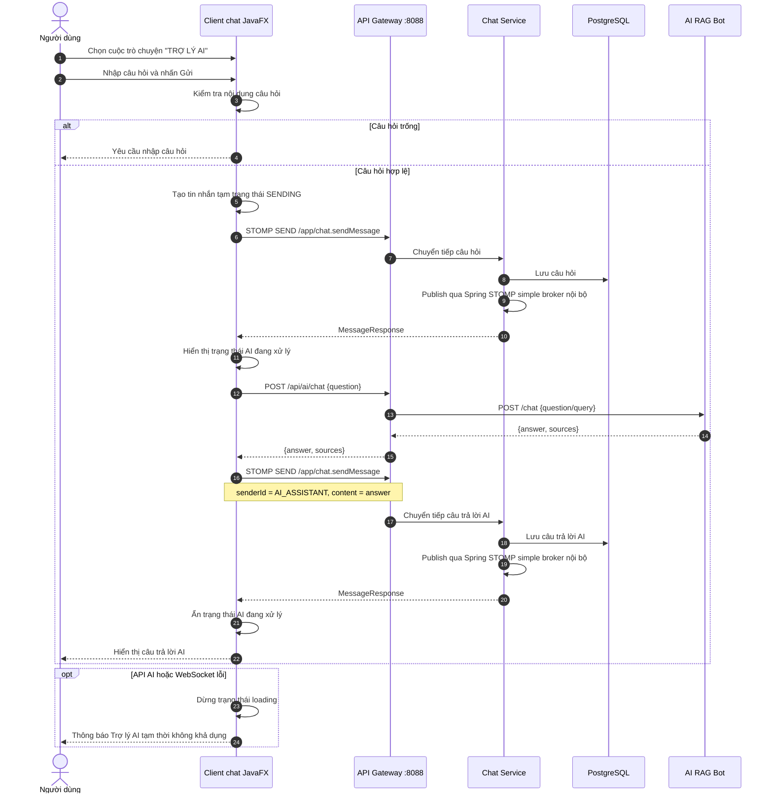
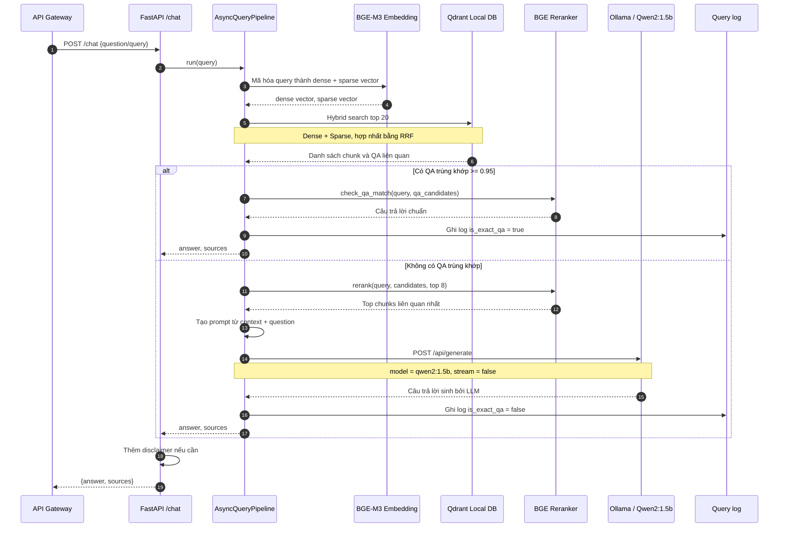

# TLTN

## Cấu trúc thư mục dự án

Hệ thống được tổ chức thành các thư mục tương ứng với các microservice và các client khác nhau:

*   **`AI Module`**: Chứa mã nguồn của Trợ lý AI RAG (FastAPI, sử dụng mô hình nhúng BGE-M3, lưu trữ vector trong Qdrant Local DB, và tích hợp Ollama Qwen2).
*   **`api-gateway`**: Cổng API tập trung (Spring Cloud Gateway) làm nhiệm vụ định tuyến yêu cầu từ Client tới các microservices.
*   **`chat-service`**: Microservice quản lý các cuộc trò chuyện, tin nhắn, thả cảm xúc, ghim tin nhắn và kết nối WebSocket (Java Spring Boot). Thiết kế theo chuẩn **DDD** và **Clean Architecture**.
*   **`chat-system`**: Chứa cấu hình Docker Compose (`docker-compose.yml`) để triển khai toàn bộ hệ thống gồm các microservices, cơ sở dữ liệu (PostgreSQL, Redis), máy chủ định danh Keycloak và các service hỗ trợ.
*   **`gitlab-handbook-admin`**: Ứng dụng Web dành cho Quản trị viên để quản lý danh bạ và tải lên tài liệu hướng dẫn nội bộ (Next.js / React).
*   **`gitlab-handbook-chat`**: Ứng dụng Desktop Client dành cho người dùng nhắn tin nội bộ và tra cứu Trợ lý AI (JavaFX / Maven).
*   **`mail-service`**: Chứa cấu hình và dịch vụ quản lý tài khoản email nội bộ (Docker Mailserver & Roundcube Webmail).
*   **`user-service`**: Microservice quản lý thông tin hồ sơ người dùng, đồng bộ dữ liệu và phân quyền tích hợp Keycloak (Java Spring Boot). Thiết kế theo chuẩn **DDD** và **Clean Architecture**.

---

## Hướng dẫn cài đặt hệ thống

Tài liệu này hướng dẫn cài đặt và chạy hệ thống bằng Docker Desktop, Ollama và Docker Compose trên Windows.

## 1. Yêu cầu cài đặt

Cần cài trước các phần mềm sau:

- Docker Desktop: dùng để chạy các service bằng container.
- Ollama: dùng để tải và kiểm tra model AI local.
- Git: dùng để clone source code từ GitHub.
- JDK 21: dùng để chạy và đóng gói client chat desktop.
- Node.js 20 trở lên: dùng để chạy client admin web.
- PowerShell hoặc Windows Terminal.

Sau khi cài Docker Desktop, mở Docker Desktop và chờ trạng thái Docker Engine chạy ổn định trước khi chạy các lệnh bên dưới.

## 2. Yêu cầu phần cứng

Hệ thống chạy nhiều service cùng lúc bằng Docker Compose, bao gồm PostgreSQL, Redis, Keycloak, mail server, API Gateway, chat service, user service, AI RAG bot và Ollama. Máy chạy server nên có cấu hình đủ để Docker và model AI hoạt động ổn định.

### 2.1. Cấu hình tối thiểu

- CPU: 4 nhân.
- RAM: 8 GB.
- Ổ đĩa trống: 20 GB.
- Hệ điều hành: Windows 10/11 64-bit.
- Docker Desktop: bật WSL 2 backend.
- Mạng: có kết nối Internet trong lần chạy đầu để tải Docker image và model.

Cấu hình tối thiểu phù hợp để chạy thử, demo nhanh hoặc phát triển với ít người dùng.

### 2.2. Cấu hình khuyến nghị

- CPU: 6 đến 8 nhân trở lên.
- RAM: 16 GB trở lên.
- Ổ đĩa trống: 40 GB trở lên, ưu tiên SSD.
- GPU: không bắt buộc, nhưng nếu có GPU hỗ trợ Ollama thì tốc độ phản hồi AI sẽ tốt hơn.
- Mạng LAN ổn định nếu có client kết nối từ máy khác.

Cấu hình khuyến nghị phù hợp để chạy đầy đủ server, client admin web, client chat desktop và AI local cùng lúc.

### 2.3. Tài nguyên Docker Desktop khuyến nghị

Trong Docker Desktop, vào `Settings` > `Resources` và cấp tối thiểu:

- CPU: 4 cores.
- Memory: 8 GB.
- Disk image size: 40 GB trở lên.

Nếu máy có 16 GB RAM trở lên, nên cấp Docker khoảng 8 đến 12 GB RAM để Keycloak, database và Ollama chạy ổn định hơn.

## 3. Cài Docker Desktop

1. Tải Docker Desktop tại trang chính thức: https://www.docker.com/products/docker-desktop/
2. Cài đặt Docker Desktop theo hướng dẫn mặc định.
3. Khởi động lại máy nếu trình cài đặt yêu cầu.
4. Mở Docker Desktop.
5. Kiểm tra Docker trong PowerShell:

```powershell
docker --version
docker compose version
```

Nếu hai lệnh trên hiển thị phiên bản Docker và Docker Compose là đã cài thành công.

## 4. Cài Ollama và tải model Qwen2:1.5B

1. Tải Ollama tại trang chính thức: https://ollama.com/download
2. Cài đặt và mở Ollama.
3. Mở PowerShell và tải model:

```powershell
ollama pull qwen2:1.5b
```

4. Kiểm tra model đã tải:

```powershell
ollama list
```

Trong danh sách model cần có `qwen2:1.5b`.

Lưu ý: Trong `chat-system/docker-compose.yml`, service `ollama` cũng build sẵn image với model `qwen2:1.5b`. Việc pull bằng Ollama Desktop giúp kiểm tra trước model và môi trường Ollama trên máy.

## 5. Clone project

Chọn thư mục muốn lưu project, sau đó chạy:

```powershell
git clone git@github.com:DanhPhuongNha-22130191/TLTN.git
cd TLTN
```

Nếu chưa cấu hình SSH key cho GitHub, có thể dùng HTTPS:

```powershell
git clone https://github.com/DanhPhuongNha-22130191/TLTN.git
cd TLTN
```

## 6. Chạy hệ thống bằng Docker Compose

Di chuyển vào thư mục `chat-system`:

```powershell
cd chat-system
```

Chạy toàn bộ hệ thống:

```powershell
docker compose up -d
```

Lần chạy đầu tiên có thể mất nhiều thời gian vì Docker cần tải image, build image Ollama và chuẩn bị model `qwen2:1.5b`.

Kiểm tra trạng thái container:

```powershell
docker compose ps
```

Xem log khi cần kiểm tra lỗi:

```powershell
docker compose logs -f
```

## 7. Cài đặt và chạy client

Hệ thống có 2 client:

- Client chat desktop: thư mục `gitlab-handbook-chat`.
- Client admin web: thư mục `gitlab-handbook-admin`.

Nên chạy server bằng Docker Compose trước, sau đó mới mở client.

### 7.1. Client chat desktop

Client chat là ứng dụng JavaFX, cần JDK 21.

Kiểm tra Java:

```powershell
java -version
```

Nếu chưa có JDK 21, cài JDK 21 rồi cấu hình biến môi trường `JAVA_HOME`.

Chạy client trực tiếp bằng Maven Wrapper:

```powershell
cd ..\gitlab-handbook-chat
.\mvnw.cmd clean javafx:run
```

Mặc định client kết nối tới API Gateway:

```text
http://localhost:8088
```

Nếu client chạy trên máy khác trong cùng mạng LAN, tạo file `.env` từ file mẫu:

```powershell
Copy-Item .env.example .env
```

Sửa file `.env`:

```env
GATEWAY_HOST=192.168.1.91
GATEWAY_PORT=8088
GATEWAY_SCHEME=http
```

Thay `192.168.1.91` bằng IP của máy đang chạy Docker Compose.

Đóng gói client chat để cài đặt hoặc gửi sang máy khác:

```powershell
.\build-setup.ps1 -ServerIP localhost
```

Nếu đóng gói cho máy khác trong LAN:

```powershell
.\build-setup.ps1 -ServerIP 192.168.1.91
```

File build sẽ nằm trong thư mục:

```text
gitlab-handbook-chat\dist
```

### 7.2. Client admin web

Client admin web là ứng dụng Next.js, cần Node.js 20 trở lên.

Kiểm tra Node.js và npm:

```powershell
node --version
npm --version
```

Cài dependency và chạy client admin:

```powershell
cd ..\gitlab-handbook-admin
npm install
npm run dev
```

Mở trình duyệt:

```text
http://localhost:3000
```

Client admin mặc định gọi API Gateway tại:

```text
http://localhost:8088
```

Trong màn hình admin có thể chỉnh API URL nếu server chạy trên máy khác trong LAN, ví dụ:

```text
http://192.168.1.91:8088
```

## 8. Mở tường lửa cho port 8088

API Gateway của hệ thống chạy ở port `8088`. Nếu máy khác trong cùng mạng cần truy cập vào hệ thống, mở Windows Firewall cho port này.

Mở PowerShell bằng quyền Administrator, sau đó chạy:

```powershell
New-NetFirewallRule -DisplayName "TLTN API Gateway 8088" -Direction Inbound -Protocol TCP -LocalPort 8088 -Action Allow
```

Kiểm tra rule đã tạo:

```powershell
Get-NetFirewallRule -DisplayName "TLTN API Gateway 8088"
```

## 9. Truy cập hệ thống

Sau khi các container chạy ổn định, các cổng chính:

- API Gateway: http://localhost:8088
- Keycloak: http://localhost:8081
- Webmail Roundcube: http://localhost:8085
- Client admin web: http://localhost:3000

Tài khoản quản trị mặc định trong compose:

- Keycloak username: `admin`
- Keycloak password: `admin`
- Mail admin: `admin@gitlab.handbook.local`
- Mail admin password: `admin123`

## 10. Lược đồ tuần tự tra cứu AI

Phần này mô tả luồng người dùng tra cứu bằng Trợ lý AI trong client chat desktop. Để dễ nhìn, lược đồ được tách thành 2 phần: luồng tổng thể qua các service và luồng xử lý nội bộ của RAG pipeline. STOMP broker là simple broker nội bộ của `chat-service`, không phải service riêng.

### 10.1. Luồng tổng thể từ client đến AI



### 10.2. Luồng xử lý nội bộ trong AI RAG Bot



File PlantUML có sẵn tại:

- `docs/diagrams/sequence/sequence-ai-search-overview.puml`
- `docs/diagrams/sequence/sequence-ai-rag-internal.puml`

## 11. Dừng hệ thống

Trong thư mục `chat-system`, chạy:

```powershell
docker compose down
```

Nếu muốn xoá cả dữ liệu volume để chạy lại từ đầu:

```powershell
docker compose down -v
```

Chỉ dùng `docker compose down -v` khi chắc chắn không cần giữ dữ liệu cũ.

## 12. Một số lỗi thường gặp

Nếu Docker báo không kết nối được Docker Engine:

- Mở Docker Desktop và chờ Docker chạy hoàn tất.
- Kiểm tra lại bằng `docker ps`.

Nếu port `8088`, `8081` hoặc `8085` đã được dùng:

- Tìm process đang dùng port:

```powershell
netstat -ano | findstr :8088
```

- Dừng process đang chiếm port hoặc đổi port trong `chat-system/docker-compose.yml`.

Nếu service Ollama mất nhiều thời gian để healthy:

- Chờ Docker build/pull model hoàn tất.
- Kiểm tra log:

```powershell
docker compose logs -f ollama
```

Nếu client chat không kết nối được server:

- Kiểm tra server Docker Compose đã chạy bằng `docker compose ps`.
- Kiểm tra API Gateway mở được tại `http://localhost:8088`.
- Nếu client chạy ở máy khác, kiểm tra file `.env` hoặc build lại bằng `.\build-setup.ps1 -ServerIP <IP_SERVER>`.
- Kiểm tra firewall máy server đã mở port `8088`.

Nếu client admin không mở được:

- Kiểm tra đã chạy `npm install`.
- Kiểm tra port `3000` chưa bị ứng dụng khác sử dụng.
- Kiểm tra API URL trong màn hình admin đang trỏ đúng về `http://localhost:8088` hoặc `http://<IP_SERVER>:8088`.
# internal-chat-app
